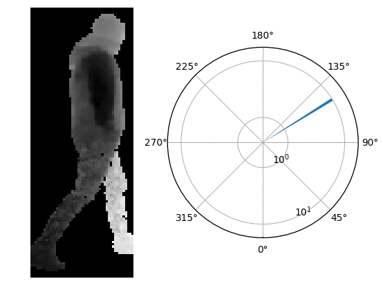
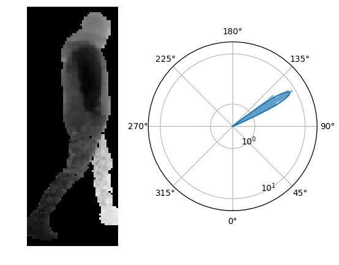
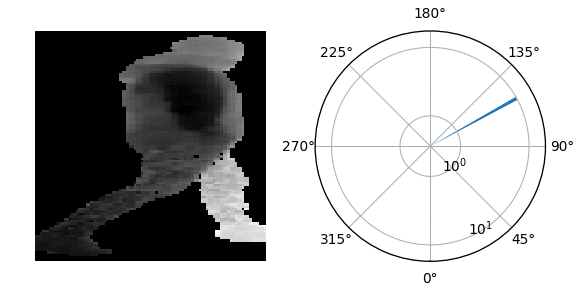
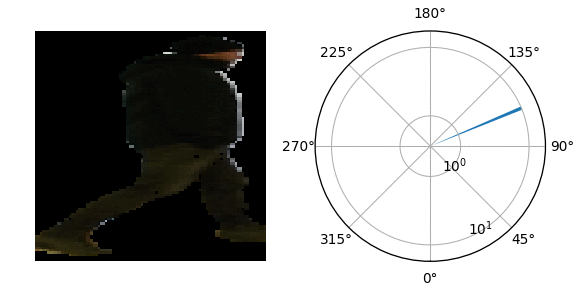

# Deep Orientation

Fast and Robust Upper Body Orientation Estimation for Mobile Robotic Applications using Tensorflow (Python 3.6).

## Installation

1. Clone repository:
    ```bash
    git clone https://github.com/tui-nicr/deep-orientation.git
    ```

2. Set up environment and install dependencies:
    ```bash
    # create Python 3.6 environment
    conda create --name env_deep_orientation python=3.6
    conda activate env_deep_orientation
 
    # install dependencies
    # GPU version:
    pip install -r /path/to/this/repository/requirements_gpu.txt [--user]
    # CPU version:
    pip install -r /path/to/this/repository/requirements_cpu.txt [--user]
    
    # opt. dependencies to plot models, see src/plot_models.py
    conda install graphviz pydot
    ```

3. For network training: Download [NICR RGB-D Orientation Data Set](https://www.tu-ilmenau.de/neurob/data-sets-code/rgb-d-orientation/) and install [dataset package](https://github.com/tui-nicr/nicr-rgb-d-orientation-data-set)  
    

## Apply already trained network for orientation estimation
- Change directory to `src`
    ```bash
    cd /path/to/this/repository/src
    ```

- Apply best performing modified beyer architecture network (depth input, biternion output, mean absolute error of 5.28° on test set)
    ```
    # single prediction (without dropout sampling)
    python inference.py \
        beyer_mod_relu \
        ../trained_networks/beyer_mod_relu__depth__126x48__biternion__0_030000__1/weights_valid_0268.hdf5 \
        ../nicr_rgb_d_orientation_data_set_examples/small_patches \
        --input_type depth \
        --input_preprocessing standardize \
        --input_height 126 \
        --input_width 48 \
        --output_type biternion \
        --n_samples 1
        [--cpu]
    ```
    
    
    
    ```bash
    # multiple predictions to estimate uncertainty (with dropout sampling)
    python inference.py \
        beyer_mod_relu \
        ../trained_networks/beyer_mod_relu__depth__126x48__biternion__0_030000__1/weights_valid_0268.hdf5 \
        ../nicr_rgb_d_orientation_data_set_examples/small_patches \
        --input_type depth \
        --input_preprocessing standardize \
        --input_height 126 \
        --input_width 48 \
        --output_type biternion \
        --n_samples 25
        [--cpu]      
    ```
    
 
- Apply best performing MobileNet v2 architecture network (depth input, biternion output, mean absolute error of 5.17° on test set)
    ```bash
    # single prediction (without dropout sampling)
    python inference.py \
        mobilenet_v2 \
        ../trained_networks/mobilenet_v2_1_00__depth__96x96__biternion__0_001000__2/weights_valid_0268.hdf5 \
        ../nicr_rgb_d_orientation_data_set_examples/small_patches \
        --input_type depth \
        --input_preprocessing scale01 \
        --input_height 96 \
        --input_width 96 \
        --output_type biternion \
        --mobilenet_v2_alpha 1.00 \
        --n_samples 1
        [--cpu]      
    ```
    
    
    
 - Apply best performing RGB MobileNet v2 architecture network (rgb input, biternion output, mean absolute error of 7.98° on test set)
    ```bash
    # single prediction (without dropout sampling)
    python inference.py \
        mobilenet_v2 \
        ../trained_networks/mobilenet_v2_1_00__rgb__96x96__biternion__0_001000__0/weights_valid_0134.hdf5 \
        ../nicr_rgb_d_orientation_data_set_examples/small_patches \
        --input_type rgb \
        --input_preprocessing scale01 \
        --input_height 96 \
        --input_width 96 \
        --output_type biternion \
        --mobilenet_v2_alpha 1.00 \
        --n_samples 1
        [--cpu]     
    ```
    
        


## Train neural network for orientation estimation
1. Change directory to `src`
    ```bash
    cd /path/to/this/repository/src
    ```
    
2. Extract patches
    ```bash
    python extract_patches.py --dataset_basepath /path/to/nicr_rgb_d_orientation_data_set
    ```

3. Train (GPU only) multiple neural networks with same hyperparameters 
    ```bash
    # best performing configuration and hyperparameters from paper
    python train.py \
        beyer_mod_relu \
        --dataset_basepath /path/to/nicr_rgb_d_orientation_data_set \
        --output_basepath /path/where/to/store/training/output/files \
        --input_type depth \
        --input_preprocessing standardize \
        --input_height 126 \
        --input_width 48 \
        --output_type biternion \
        --learning_rate 0.03 \
        --run_id 0
    python train.py \
        beyer_mod_relu \
        --dataset_basepath /path/to/nicr_rgb_d_orientation_data_set \
        --output_basepath /path/where/to/store/training/output/files \
        --input_type depth \
        --input_preprocessing standardize \
        --input_height 126 \
        --input_width 48 \
        --output_type biternion \
        --learning_rate 0.03 \
        --run_id 1
    python train.py \
        beyer_mod_relu \
        --dataset_basepath /path/to/nicr_rgb_d_orientation_data_set \
        --output_basepath /path/where/to/store/training/output/files \
        --input_type depth \
        --input_preprocessing standardize \
        --input_height 126 \
        --input_width 48 \
        --output_type biternion \
        --learning_rate 0.03 \
        --run_id 2
    ```
    For further details and parameters, see:
    ```txt
    python train.py --help
    usage: train.py [-h] [-o OUTPUT_BASEPATH] [-db DATASET_BASEPATH]
                    [-ds {small,large}] [-ts TRAINING_SET]
                    [-vs VALIDATION_SETS [VALIDATION_SETS ...]]
                    [-it {depth,rgb,depth_and_rgb}] [-iw INPUT_WIDTH]
                    [-ih INPUT_HEIGHT] [-ip {standardize,scale01,none}]
                    [-ot {regression,classification,biternion}]
                    [-lr LEARNING_RATE] [-lrd {poly}] [-m MOMENTUM] [-ne N_EPOCHS]
                    [-es EARLY_STOPPING] [-b BATCH_SIZE]
                    [-vb VALIDATION_BATCH_SIZE] [-nc N_CLASSES] [-k KAPPA]
                    [-opt {sgd,adam,rmsprop}] [-naug] [-rid RUN_ID]
                    [--mobilenet_v2_alpha {0.35,0.5,0.75,1.0}] [-d DEVICES] [-v]
                    {beyer,beyer_mod,beyer_mod_relu,mobilenet_v2,beyer_mod_relu_sep}

    Train neural network for orientation estimation

    positional arguments:
    {beyer,beyer_mod_relu,mobilenet_v2}
                          Model to use: beyer, beyer_mod_relu or mobilenet_v2
    optional arguments:
    -h, --help            show this help message and exit
    -o OUTPUT_BASEPATH, --output_basepath OUTPUT_BASEPATH
                            Path where to store output files, default: '/results/rotator'
    -db DATASET_BASEPATH, --dataset_basepath DATASET_BASEPATH
                            Path to downloaded dataset (default: '/datasets/rotator')
    -ds {small,large}, --dataset_size {small,large}
                            Dataset image size to use. One of :('small', 'large'), default: small
    -ts TRAINING_SET, --training_set TRAINING_SET
                            Set to use for training, default: training
    -vs VALIDATION_SETS [VALIDATION_SETS ...], --validation_sets VALIDATION_SETS [VALIDATION_SETS ...]
                            Sets to use for validation, default: [validation, test]
    -it {depth,rgb,depth_and_rgb}, --input_type {depth,rgb,depth_and_rgb}
                            Input type. One of ('depth', 'rgb', 'depth_and_rgb'), default: depth
    -iw INPUT_WIDTH, --input_width INPUT_WIDTH
                            Patch width to use, default: 96
    -ih INPUT_HEIGHT, --input_height INPUT_HEIGHT
                            Patch height to use, default: 96
    -ip {standardize,scale01,none}, --input_preprocessing {standardize,scale01,none}
                            Preprocessing to apply. One of [standardize, scale01, none], default: standardize
    -ot {regression,classification,biternion}, --output_type {regression,classification,biternion}
                            Output type. One of ('regression', 'classification', 'biternion'), default: biternion)
    -lr LEARNING_RATE, --learning_rate LEARNING_RATE
                            (Base) learning rate, default: 0.01
    -lrd {poly}, --learning_rate_decay {poly}
                            Learning rate decay to use, default: poly
    -m MOMENTUM, --momentum MOMENTUM
                            Momentum to use, default: 0.9
    -ne N_EPOCHS, --n_epochs N_EPOCHS
                            Number of epochs to train, default: 800
    -es EARLY_STOPPING, --early_stopping EARLY_STOPPING
                            Number of epochs with no improvement after which training will be stopped, default: 100.To disable early stopping use -1.
    -b BATCH_SIZE, --batch_size BATCH_SIZE
                            Batch size to use, default: 128
    -vb VALIDATION_BATCH_SIZE, --validation_batch_size VALIDATION_BATCH_SIZE
                            Batch size to use for validation, default: 512
    -nc N_CLASSES, --n_classes N_CLASSES
                            Number of classes when output_type is classification, default: 8
    -k KAPPA, --kappa KAPPA
                            Kappa to use when output_type is biternion or regression, default: biternion: 1.0, regression: 0.5
    -opt {sgd,adam,rmsprop}, --optimizer {sgd,adam,rmsprop}
                            Optimizer to use, default: sgd
    -naug, --no_augmentation
                            Disable augmentation
    -rid RUN_ID, --run_id RUN_ID
                            Run ID (default: 0)
    -ma {0.35,0.5,0.75,1.0}, --mobilenet_v2_alpha {0.35,0.5,0.75,1.0}
                            Alpha value for MobileNet v2 (default: 1.0)
    -d DEVICES, --devices DEVICES
                            GPU device id(s) to train on. (default: 0)
    -v, --verbose         Enable verbose output
    ```

3. Evaluate trained networks
    ```bash
    # this creates a json file containing a deeper analysis of the trained networks
    python eval.py \
        biternion \
        --dataset_basepath /path/to/nicr_rgb_d_orientation_data_set \
        --set test \
        --output_path /path/where/to/store/evaluation/output/files \
        --training_basepath /path/where/to/store/training/output/files
    ```

    For further details and parameters, see:
    ```txt
    python eval.py --help
    usage: eval.py [-h] [-o OUTPUT_PATH] [-tb TRAINING_BASEPATH]
                [-s {validation,test}] [-ss {training,validation,test}]
                [-db DATASET_BASEPATH] [-ds {small,large}] [-v]
                {regression,classification,biternion}

    Evaluate trained neural networks for orientation estimation

    positional arguments:
    {regression,classification,biternion}
                            Output type. One of ('regression', 'classification', 'biternion') (default: biternion)

    optional arguments:
    -h, --help            show this help message and exit
    -o OUTPUT_PATH, --output_path OUTPUT_PATH
                            Path where to store created output files, default: '../eval_outputs/' relative to the location of this script
    -tb TRAINING_BASEPATH, --training_basepath TRAINING_BASEPATH
                            Path to training outputs (default: '/results/rotator')
    -s {validation,test}, --set {validation,test}
                            Set to use for evaluation, default: test
    -ss {training,validation,test}, --selection_set {training,validation,test}
                            Set to use for deriving the best epoch, default: validation
    -db DATASET_BASEPATH, --dataset_basepath DATASET_BASEPATH
                            Path to downloaded dataset (default: '/datasets/rotator')
    -ds {small,large}, --dataset_size {small,large}
                            Dataset image size to use. One of :('small', 'large'), default: small
    -v, --verbose         Enable verbose output
    ```

## License and Citations
The source code and the network weights are published under BSD 3-Clause 
license, see [license file](LICENSE) for details.

If you use the source code or the network weights, please cite the following paper:
>Benjamin Lewandowski, Daniel Seichter, Tim Wengefeld, Lennard Pfennig, 
Helge Drumm and Horst-Michael Gross
*Deep Orientation: Fast and Robust Upper Body Orientation Estimation for Mobile 
Robotic Applications.*
To be published in: 
IEEE International Conference on Intelligent Robots and Systems (IROS) 2019

```bibtex
@InProceedings{Lewandowski-IROS-2019,
  author    = {Lewandowski, Benjamin and Seichter, Daniel and Wengefeld, Tim and Pfennig, Lennard and Drumm, Helge and Gross, Horst-Michael},
  title     = {Deep Orientation: Fast and Robust Upper Body Orientation Estimation for Mobile Robotic Applications},
  booktitle = {IEEE/RSJ Int. Conf. on Intelligent Robots and Systems (IROS), Macau},
  year      = {2019},
  pages     = {441--448},
  publisher = {IEEE},
}
```


